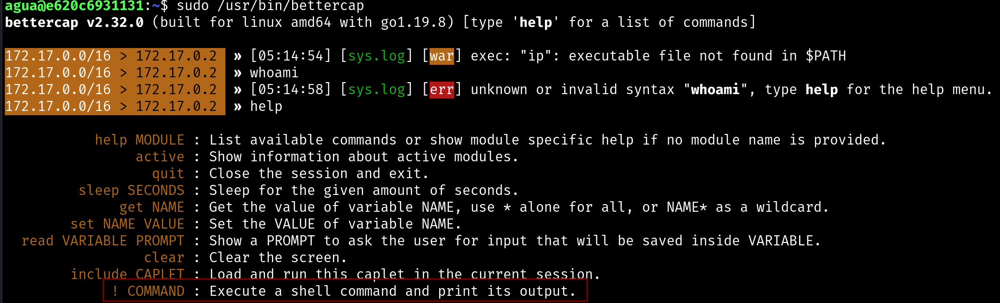

# aguademayo [dockerlabs]

- We enumerate as usual, and we see SSH and HTTP.
- We use Dirbuster and go to /images, the only directory.
- There’s an image, we download it.
- We try to extract information with steghide, but it’s password protected, and we can’t access it.
- We attempt to brute force it, but we can’t break it.
- We explore the source code of the index, which looks default, and in the end, we see:


```bash
++++++++++[>++++++++++>++++++++++>++++++++++>++++++++++>++++++++++>++++++++++>++++++++++++>++++++++++>+++++++++++>++++++++++++>++++++++++>++++++++++++>++++++++++>+++++++++++>+++++++++++>+>+<<<<<<<<<<<<<<<<<-]>--.>+.>--.>+.>---.>+++.>---.>---.>+++.>---.>+..>-----..>---.>.>+.>+++.>.

```

- We use https://www.splitbrain.org/_static/ook/ after a Google search, and it gives us the result: bebeaguaqueessano
- We try SSH as root with that password, but it doesn’t work.
- We attempt steghide extract with that password, but it fails.
- Since the file we downloaded is named “agua_ssh,” we try using the username "agua" and the extracted password ‘bebeaguaqueessano’.
- 

# escalada



_______________

# Report

## Enumeration

```bash
└─#  nmap -p- --open -sS --min-rate 5000 -vvv -n -Pn  $target -oG allPorts

```


Found open ports 22 and 80

### web enumeration
 

Downloaded image and tried to bruteforce it

made curl and saw this at the bottom:


```bash
 ~  curl -vvv http://172.17.0.2                                                                                                                                                                                                                                                                                                                           ✔  06:24:51 

```

used [https://www.splitbrain.org/_static/ook/](https://www.splitbrain.org/_static/ook/) previous google search to understand wtf was that

result was


tried ssh with that pass and user root, without luck

tried extract image with that idem

finally ssh was with user ‘agua’ since agua was part of the name of the image

once ssh’ed ran sudo -l


found better cap and saw that could run shell commands

sent a reverse shell and finish